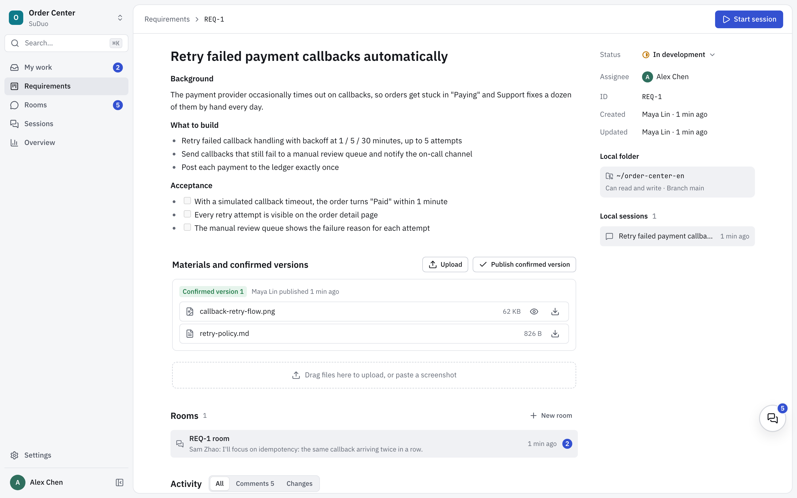
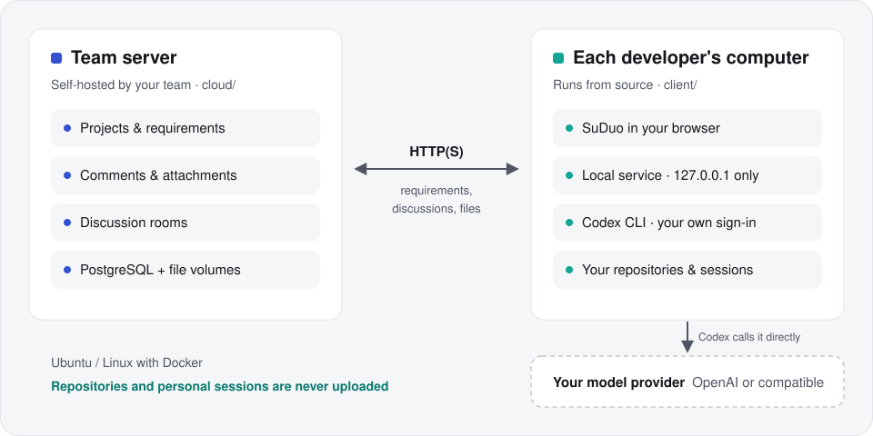
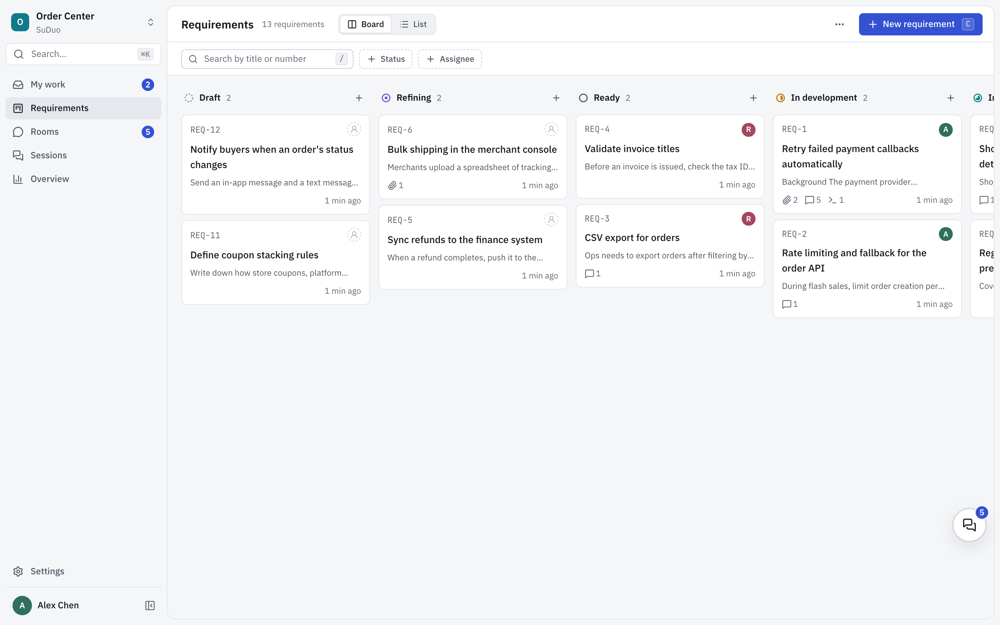
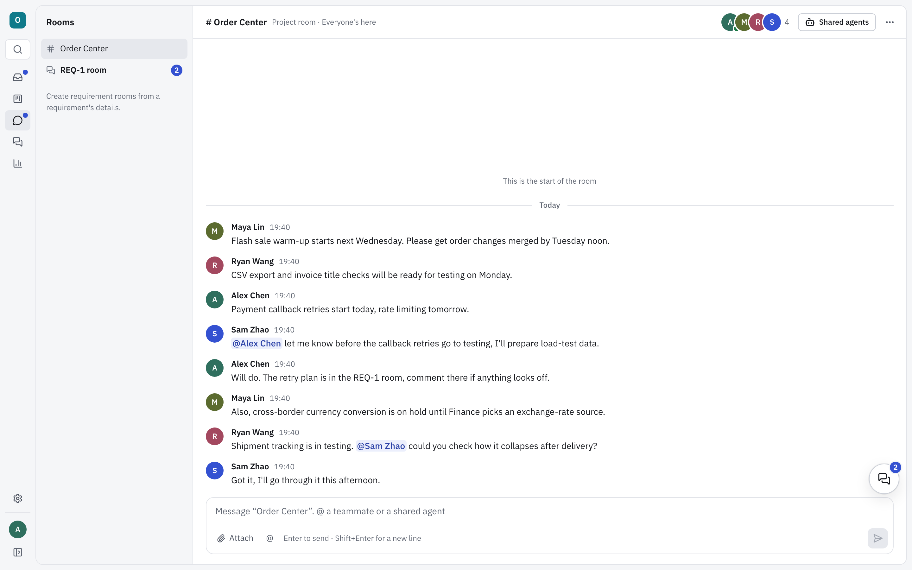

<div align="center">

<picture>
  <source media="(prefers-color-scheme: dark)" srcset=".github/assets/logo-dark.svg">
  
</picture>

# SuDuo

**Requirements live with your team. Code stays on your machine.**

A self-hosted requirements workspace for teams that build with the Codex CLI.

[](https://github.com/Im-Sue/suduo-workbench/releases)
[](https://github.com/Im-Sue/suduo-workbench/actions/workflows/ci.yml)
[](LICENSE)
[](client/README.md)
[](cloud/DEPLOYMENT.md)

[Quick start](#quick-start) · [How it works](#how-it-works) · [Commercial use](COMMERCIAL.md) · [Changelog](CHANGELOG.md) · [中文](README.zh-CN.md)

</div>

<br>



<p align="center"><sub>SuDuo is available in English and Simplified Chinese; see <a href="#language">Language</a>.</sub></p>

## What is SuDuo

SuDuo (速舵) is where a development team keeps its requirements and discussions, and where each developer turns a requirement into a Codex session on their own computer.

- **Shared requirements, on your own server.** Requirements, attachments and discussion rooms live on a server your team deploys. Everyone works from the same board.
- **From requirement to Codex in one click.** Start a local Codex session from any requirement. Codex reads the requirement through SuDuo's tools and writes its conclusions back.
- **Your code stays on your machine.** Repositories, Codex sessions and model credentials stay on each developer's computer. There is no SuDuo service in between.

## How it works



| On the team server | On each developer's computer |
|---|---|
| Projects, requirements, comments and attachments | Code repositories |
| Discussion rooms, messages and room files | Codex sessions, approvals and their history |
| Accounts and activity history | Codex configuration and model credentials |
| Answers from agents that members share into a room | Which local folder belongs to which project |

1. **Deploy the server** once per team: one command on a Linux server with Docker.
2. **Run the client** on each computer and connect it to the server.
3. **Choose the folder** where each project's code lives.
4. **Discuss a requirement, then start a session from it.** Codex works in that folder.

## Features

**Requirements**

- Board and list views, seven statuses, assignees and `REQ-n` numbers
- Requirement pages with Markdown, comments, attachments and a full activity history
- Confirmed versions: publish the agreed set of materials so everyone builds from the same files
- Overview of status distribution, flow over time and requirements that have stalled
- My work: what needs your answer, your requirements, your sessions and recent activity

**Discussion rooms**

- A room for every project, and rooms for individual requirements
- Threads, @mentions, files and video
- Shared agents: share your Codex into a room, and teammates can @ it. It runs read-only on your computer and replies in the thread
- Floating room windows that stay open while you move around

**Local Codex workbench**

- Sessions linked to requirements, with tools to read the requirement and record conclusions
- Approvals, commands, file changes and diffs in one timeline
- Git checkpoints: an optional checkpoint before every turn, and one-click restore
- Skills, `@` file references and a message queue in the composer
- File paths in answers open a preview at the right line, or open in VS Code
- English and Simplified Chinese interface, light and dark themes, keyboard shortcuts and a command palette

**Self-hosting**

- One script installs, upgrades, backs up and restores the server
- Backups cover the database and file volumes together; upgrades back up first
- Mirrors for mainland China with `--mirror cn`
- The client tells you when its version differs from the server's

<table>
  <tr>
    <td width="50%"></td>
    <td width="50%"></td>
  </tr>
  <tr>
    <td align="center"><sub>Requirements board</sub></td>
    <td align="center"><sub>Project discussion room</sub></td>
  </tr>
</table>

## Quick start

| | You need |
|---|---|
| Team server | Ubuntu 22.04 / 24.04 (other Linux: best effort), 2 CPU cores, 4 GB RAM, Docker with Compose, git |
| Each computer | macOS 13.5+ (Apple silicon or Intel) or Windows 10 / 11 (x64); Node.js 24 LTS (24.10+), pnpm 10.25, git |
| Model | A ChatGPT sign-in for Codex, or an API key for OpenAI or a compatible service |

**1. Deploy the server** (once per team, on the server):

```bash
git clone https://github.com/Im-Sue/suduo-workbench.git
cd suduo-workbench
git checkout "$(git describe --tags --abbrev=0)"   # the latest release
cd cloud
sudo ./scripts/suduo-cloud.sh install               # add --mirror cn in mainland China
```

The script prints the address when the server is ready. The [deployment guide](cloud/DEPLOYMENT.md) covers upgrades, backups and HTTPS.

**2. Run the client** (each person, on their own computer; the same commands work in Terminal and PowerShell):

```bash
git clone https://github.com/Im-Sue/suduo-workbench.git
cd suduo-workbench
git checkout "$(git describe --tags --abbrev=0)"   # use the same release as your server
cd client
pnpm install
pnpm start
```

`pnpm start` checks your environment, builds SuDuo the first time (about 1–2 minutes), starts it on `http://127.0.0.1:8787` and opens your browser.

**3. Connect.** Sign in to Codex with `pnpm exec codex login`, or set your model service in SuDuo under **Settings → Model service**. Then enter the server address under **Settings → Requirements service**, register, choose the folder for your project, open a requirement and start a session.

The [client guide](client/README.md) covers Codex setup in detail, updating, where your data is kept, and troubleshooting.

## Language

SuDuo's interface is available in English and Simplified Chinese. It follows your system language by default (as your browser reports it); to change it, go to **Settings → Appearance → Language**. Each person chooses their own language. If you used an earlier version and your browser's language isn't Chinese, the interface switches to English after the upgrade; choose **简体中文** there to switch back.

- **Only SuDuo's own text changes language.** Menus, messages, errors and the records SuDuo adds to activity feeds and rooms appear in each person's own language. What people write (requirements, comments, room messages, file names) and Codex's answers are shown exactly as written, never translated.
- **Codex.** The instructions and tool descriptions SuDuo gives Codex are in the language the session was started in, and stay that way if you switch the interface later. SuDuo asks Codex to reply in the language you write in, so a question in Chinese normally gets an answer in Chinese even when the interface is in English. SuDuo never translates Codex's answers.
- **Command line.** `pnpm start`, `pnpm run doctor` and the server script follow the system locale. Set `SUDUO_LOCALE=zh-CN` or `SUDUO_LOCALE=en` to choose. Ubuntu servers often default to `C.UTF-8`, which gives English. See the [client guide](client/README.md#language) and the [deployment guide](cloud/DEPLOYMENT.md#script-language).

## Status

SuDuo is in early access. The latest release is 0.8.0, which adds the English interface.

- There is no installer yet. The client runs from source.
- The server has no administrator or invitation system yet: anyone who can reach it can register. Keep it on a private network or VPN, or behind a reverse proxy with access control.
- Tested on macOS (Apple silicon) and on Ubuntu 22.04 / 24.04 servers. Windows and Intel Macs are supported but have had less testing.

See the [changelog](CHANGELOG.md) and [releases](https://github.com/Im-Sue/suduo-workbench/releases).

## FAQ

<details>
<summary><b>Does my code go to the server?</b></summary>
<br>

No. Codex runs on your computer, in your folder. The server only receives what you post there yourself: requirements, comments, messages, the files you attach and the confirmed versions you publish (which can include files from your project folder). If you share your agent into a room, its answers and what it did are posted in that room and can include code.

</details>

<details>
<summary><b>Can SuDuo's authors or the team server see my model credentials or requests?</b></summary>
<br>

No. Codex keeps its own configuration in `~/.codex` and talks to your model provider directly. If you set a model service in SuDuo's settings, SuDuo on your computer passes it to Codex and keeps no copy. This changes `~/.codex`, so a Codex CLI you run yourself uses it too. Nothing is sent to SuDuo's authors, and credentials never go to the team server.

</details>

<details>
<summary><b>Do I need to install Codex separately?</b></summary>
<br>

No. `pnpm install` installs the Codex CLI version that this SuDuo release is tested with (0.159.2 for SuDuo 0.8.0). It uses the same `~/.codex` as a Codex CLI you may already have.

</details>

<details>
<summary><b>Can my company use SuDuo?</b></summary>
<br>

Yes. Start right away and register within 30 days. Registration is a short email and is currently free. See [License and commercial use](#license-and-commercial-use).

</details>

<details>
<summary><b>Does the client run on Linux?</b></summary>
<br>

Linux is not a supported client platform, but the client runs there for development and testing. See [CONTRIBUTING.md](CONTRIBUTING.md).

</details>

## License and commercial use

SuDuo is **source-available, not open source**. It is licensed under the [PolyForm Noncommercial License 1.0.0](LICENSE), copyright sue.

| Who | What to do |
|---|---|
| Individuals: personal study, research, hobby projects with no anticipated commercial application | Free, no registration |
| Schools, public research organizations, charities and government institutions | Free, no registration |
| Companies and other for-profit organizations, including internal-only use | Start right away and **register within 30 days** by emailing im.suyejian@gmail.com. Registration is currently free |

[COMMERCIAL.md](COMMERCIAL.md) explains what counts as commercial use and what to include in the email. Contributions require agreeing to the [Contributor License Agreement](CLA.md). Third-party licenses are listed in [THIRD_PARTY_NOTICES.md](THIRD_PARTY_NOTICES.md).

## Contributing and contact

- **Bugs and questions**: [GitHub Issues](https://github.com/Im-Sue/suduo-workbench/issues)
- **Contributing**: [CONTRIBUTING.md](CONTRIBUTING.md)
- **Security issues**: email im.suyejian@gmail.com rather than opening a public issue
- **Commercial registration**: im.suyejian@gmail.com

Codex and OpenAI are trademarks of OpenAI. SuDuo is not affiliated with or endorsed by OpenAI. See [TRADEMARKS.md](TRADEMARKS.md).

<div align="center">
<br>
<sub>SuDuo · 速舵 · © 2026 sue</sub>
</div>
