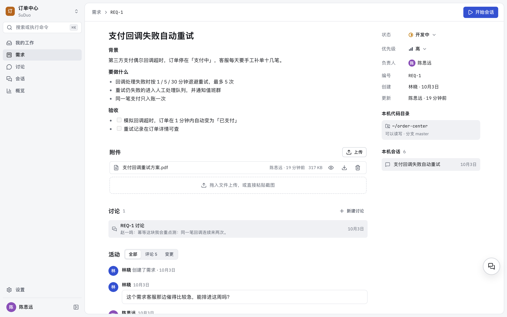
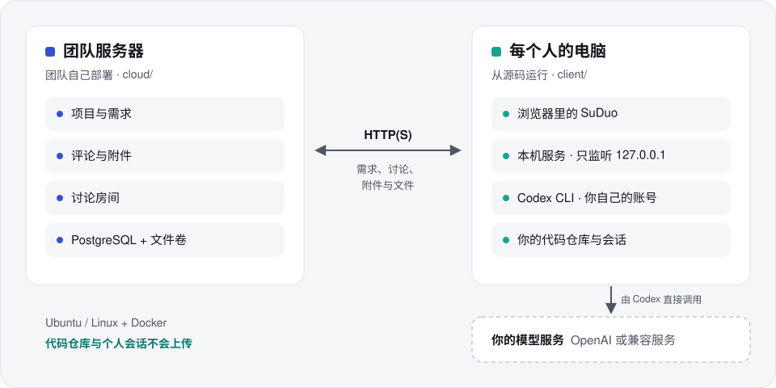
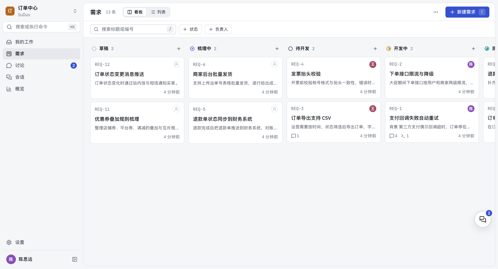
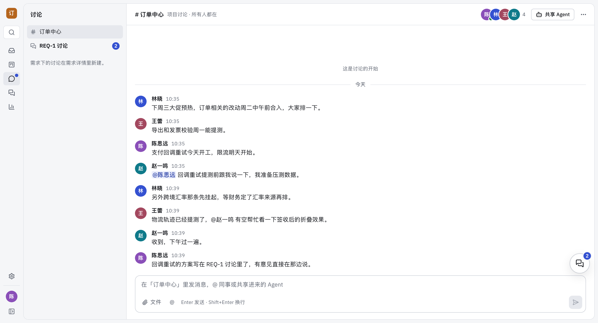

<div align="center">

<picture>
  <source media="(prefers-color-scheme: dark)" srcset=".github/assets/logo-dark.svg">
  
</picture>

# 速舵 SuDuo

**速度交给 AI，方向由团队掌舵。**

给用 Codex CLI 开发的团队准备的、可以自己部署的需求协作工作台。

[](https://github.com/Im-Sue/suduo-workbench/releases)
[](https://github.com/Im-Sue/suduo-workbench/actions/workflows/ci.yml)
[](LICENSE.zh-CN.md)
[](client/README.zh-CN.md)
[](cloud/DEPLOYMENT.zh-CN.md)

[官网](https://suduo.dev/zh/) · [快速开始](#快速开始) · [工作方式](#工作方式) · [商业使用](COMMERCIAL.zh-CN.md) · [更新日志](CHANGELOG.zh-CN.md) · [English](README.md)

</div>

> 本页为中文版。若与英文版 [README.md](README.md) 有出入，以英文版为准。



## 速舵是什么

速舵 SuDuo 让开发团队在一个地方管理需求和讨论，每个开发者再从需求出发，在自己电脑上拉起 Codex 会话干活。

- **需求共享，放在自己的服务器上。** 需求、附件和讨论房间都存在团队自己部署的服务器上，所有人看的是同一块看板。
- **从需求到 Codex，一步开工。** 在任意一条需求上直接拉起本机 Codex 会话。Codex 通过 SuDuo 提供的工具读取需求，并把结论写回去。
- **代码留在自己电脑上。** 代码仓库、Codex 会话和模型凭据都留在每个开发者的电脑上，中间没有任何 SuDuo 的服务。

## 工作方式



| 在团队服务器上 | 在每个人的电脑上 |
|---|---|
| 项目、需求、评论和附件 | 代码仓库 |
| 讨论房间、消息和房间文件 | Codex 会话、审批和历史记录 |
| 账号和活动记录 | Codex 配置和模型凭据 |
| 成员共享进房间的 Agent 给出的回答 | 哪个项目对应本机哪个目录 |

1. **部署服务器**：每个团队一次，在装有 Docker 的 Linux 服务器上执行一条命令。
2. **运行客户端**：每个人在自己电脑上运行，并连上团队服务器。
3. **选择目录**：为每个项目选择它的代码所在的本机目录。
4. **讨论需求，然后从需求开始会话。** Codex 在那个目录里干活。

## 功能

**需求**

- 看板和列表两种视图，七种状态，负责人，`REQ-n` 编号
- 需求详情支持 Markdown、评论、附件（最新的在前）和完整的活动记录
- 优先级（紧急 / 高 / 中 / 低），看板和列表按优先级排序
- 评论可以带文件，文件跟着评论走；属于需求本身的，可以存为附件
- 概览：状态分布、流转趋势、停滞的需求
- 我的工作：等你处理的事、你负责的需求、你的会话和最近动态

**讨论房间**

- 每个项目一个房间，单条需求也可以建自己的讨论
- 话题、@ 提及、文件和视频
- 共享 Agent：把自己的 Codex 共享进房间，队友可以 @ 它；它在你的电脑上只读执行，在话题里回复
- 悬浮讨论窗口，切换页面时保持打开

**本机 Codex 工作台**

- 会话和需求关联，Codex 可以用工具读取需求、记录结论
- 审批、命令、文件改动和差异对比都在一条时间线上
- Git 检查点：可选在每轮开始前自动存档，一键还原
- 输入框支持 Skill、`@` 引用文件和消息排队
- 回答里的文件路径可以点开预览到对应行，或用 VS Code 打开
- 中英文界面、亮色和暗色主题、快捷键、命令面板

**自己部署**

- 一个脚本完成服务器的安装、升级、备份和恢复
- 备份同时包含数据库和文件卷；升级前自动备份
- `--mirror cn` 使用国内镜像源
- 客户端与服务器版本不一致时会提示

<table>
  <tr>
    <td width="50%"></td>
    <td width="50%"></td>
  </tr>
  <tr>
    <td align="center"><sub>需求看板</sub></td>
    <td align="center"><sub>项目讨论</sub></td>
  </tr>
</table>

## 快速开始

| | 需要 |
|---|---|
| 团队服务器 | Ubuntu 22.04 / 24.04（其他 Linux 尽力支持），2 核 CPU、4 GB 内存，Docker 与 Compose，git |
| 每个人的电脑 | macOS 13.5+（Apple 芯片或 Intel）或 Windows 10 / 11（x64）。桌面应用不需要再装别的；从源码运行需要 Node.js 24 LTS（24.10+）、pnpm 10.25、git |
| 模型 | Codex 的 ChatGPT 登录，或 OpenAI / 兼容服务的 API Key |

**1. 部署服务器**（每个团队一次，在服务器上执行）：

```bash
git clone https://github.com/Im-Sue/suduo-workbench.git
cd suduo-workbench
git checkout "$(git describe --tags --abbrev=0)"   # 最新的发布版本
cd cloud
sudo ./scripts/suduo-cloud.sh install --mirror cn   # 在国内用镜像源；海外去掉 --mirror cn
```

服务器就绪后脚本会打印访问地址。脚本的提示跟随服务器的系统语言（Ubuntu 服务器默认常是英文）；想看中文提示，写成 `sudo SUDUO_LOCALE=zh-CN ./scripts/suduo-cloud.sh install --mirror cn`。升级、备份和 HTTPS 见[部署指南](cloud/DEPLOYMENT.zh-CN.md)。

**2. 安装客户端**（每个人在自己电脑上）。两种方式任选：

- **桌面应用（试用版）**：从[最新版本](https://github.com/Im-Sue/suduo-workbench/releases/latest)下载安装包：Apple 芯片的 Mac 用 `…-mac-arm64.dmg`，Intel 的 Mac 用 `…-mac-x64.dmg`，Windows 用 `SuDuo-Setup-…-x64.exe`。它还没有签名，第一次打开时要放行一次：macOS 在 **系统设置 → 隐私与安全性** 里点「仍要打开」；Windows 点「更多信息 → 仍要运行」。细节见[客户端指南](client/README.zh-CN.md#桌面应用试用版)。
- **从源码运行**（终端和 PowerShell 用同样的命令）：

```bash
git clone https://github.com/Im-Sue/suduo-workbench.git
cd suduo-workbench
git checkout "$(git describe --tags --abbrev=0)"   # 和服务器用同一个版本
cd client
pnpm install
pnpm start
```

`pnpm start` 会检查环境，首次运行时构建（约 1–2 分钟），在 `http://127.0.0.1:8787` 启动并打开浏览器。请和服务器用同一个版本。

**3. 连接。** 用 `pnpm exec codex login` 登录 Codex，或在 SuDuo 的 **设置 → 模型服务** 里配置模型服务。然后在 **设置 → 需求服务** 里填入服务器地址并注册，为项目选择代码目录，打开一条需求，开始会话。

Codex 配置细节、更新、数据位置和常见问题见[客户端指南](client/README.zh-CN.md)。

## 语言

界面支持简体中文和英文，默认跟随系统语言（以浏览器的语言设置为准），可以在 **设置 → 外观 → 语言** 里切换。语言是个人设置，每个人看到的是自己选的语言。用过旧版本、浏览器语言不是中文的，升级后界面会变成英文，在这里选「简体中文」即可切回。

- **只有 SuDuo 自己的文字随语言切换。** 菜单、提示、报错，以及 SuDuo 在活动记录和房间里自动写下的记录，都按各人自己的语言显示。人写的内容（需求、评论、房间消息、文件名）和 Codex 的回答原样显示，不做翻译。
- **交给 Codex 的说明。** SuDuo 给 Codex 的说明和工具描述按会话创建时的语言写，之后切换界面语言也不变。SuDuo 会要求 Codex 用你提问所用的语言回复，所以界面是英文时用中文问，通常也会得到中文回答；SuDuo 不翻译 Codex 的回答。
- **命令行。** `pnpm start`、`pnpm run doctor` 和服务器脚本的提示跟随系统语言，可以用 `SUDUO_LOCALE=zh-CN` 或 `SUDUO_LOCALE=en` 指定。Ubuntu 服务器默认的语言环境常是 `C.UTF-8`，这时脚本提示是英文。详见[客户端指南](client/README.zh-CN.md#语言)和[部署指南](cloud/DEPLOYMENT.zh-CN.md#脚本的提示语言)。

## 当前状态

速舵处于早期版本，最新版本是 0.10.0，新增了需求优先级和评论文件。macOS 与 Windows 桌面应用（0.9.0 起）为试用版。

- 桌面应用还没有签名，也不会自动更新，新版本需要到 Releases 页面下载。从源码运行照常可用。
- 服务器暂时没有管理员和邀请机制：能访问到它的人都能注册。请只在内网或 VPN 内开放，或放在带访问控制的反向代理后面。
- 在 macOS（Apple 芯片）和 Ubuntu 22.04 / 24.04 服务器上测试过；Windows 和 Intel Mac 也支持，但测试得少一些。

版本变化见[更新日志](CHANGELOG.zh-CN.md)和 [Releases](https://github.com/Im-Sue/suduo-workbench/releases)。

## 常见疑问

<details>
<summary><b>代码会传到服务器上吗？</b></summary>
<br>

不会。Codex 在你的电脑上、在你选的目录里运行。服务器只收到你自己发上去的内容：需求、评论、消息、你上传到需求和评论里的文件，以及旧版本 SuDuo 里发布过的确认版（可以包含项目目录里的文件）。如果你把自己的 Agent 共享进房间，它的回答和执行过程会发在房间里，其中可能包含代码。

</details>

<details>
<summary><b>SuDuo 的作者或团队服务器能看到我的模型凭据或请求吗？</b></summary>
<br>

不能。Codex 的配置保存在它自己的 `~/.codex` 里，并直接请求你的模型服务。在 SuDuo 设置里配置模型服务时，本机的 SuDuo 只是把配置交给 Codex，自己不留副本；这会改写 `~/.codex`，你自己在终端里用的 Codex CLI 也会跟着改。SuDuo 不会把任何东西发给作者，凭据也不会发到团队服务器。

</details>

<details>
<summary><b>需要另外安装 Codex 吗？</b></summary>
<br>

不需要。桌面应用自带这个 SuDuo 版本测试过的 Codex CLI（SuDuo 0.10.0 对应 0.159.2），从源码运行时 `pnpm install` 也会装同一个版本。两种方式都和你可能已经装好的 Codex CLI 共用 `~/.codex`。

</details>

<details>
<summary><b>公司可以用吗？</b></summary>
<br>

可以。直接开始用，30 天内发一封邮件登记即可，目前免费。见下方[许可与商业使用](#许可与商业使用)。

</details>

<details>
<summary><b>客户端能在 Linux 上运行吗？</b></summary>
<br>

Linux 不是正式支持的客户端平台，但开发和测试时可以在 Linux 上运行，见 [CONTRIBUTING.zh-CN.md](CONTRIBUTING.zh-CN.md)。

</details>

## 许可与商业使用

速舵 SuDuo **源码公开，但不是开源软件**。它以 [PolyForm Noncommercial License 1.0.0](LICENSE)（[中文参考译文](LICENSE.zh-CN.md)）授权，著作权人 sue。

| 谁在用 | 怎么做 |
|---|---|
| 个人：学习、研究、没有商业用途预期的业余项目 | 免费，不用登记 |
| 学校、公共研究机构、公益组织、政府机构 | 免费，不用登记 |
| 公司和其他营利组织，包括只在内部使用 | 直接开始用，**30 天内**发邮件到 license@suduo.dev 登记，目前免费 |

什么算商业使用、登记邮件写什么，见 [COMMERCIAL.zh-CN.md](COMMERCIAL.zh-CN.md)。参与贡献需要同意[贡献者许可协议](CLA.zh-CN.md)。第三方依赖的许可见 [THIRD_PARTY_NOTICES.md](THIRD_PARTY_NOTICES.md)。

## 参与和联系

- **问题反馈与提问**：[GitHub Issues](https://github.com/Im-Sue/suduo-workbench/issues)
- **参与贡献**：[CONTRIBUTING.zh-CN.md](CONTRIBUTING.zh-CN.md)
- **安全问题**：请发邮件到 security@suduo.dev，不要公开提 issue
- **商用登记**：license@suduo.dev

Codex 与 OpenAI 是 OpenAI 的商标，SuDuo 与 OpenAI 没有隶属或背书关系，见 [TRADEMARKS.zh-CN.md](TRADEMARKS.zh-CN.md)。

<div align="center">
<br>
<sub>速舵 SuDuo · © 2026 sue</sub>
</div>
